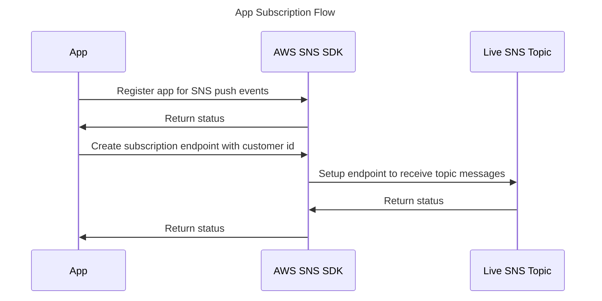
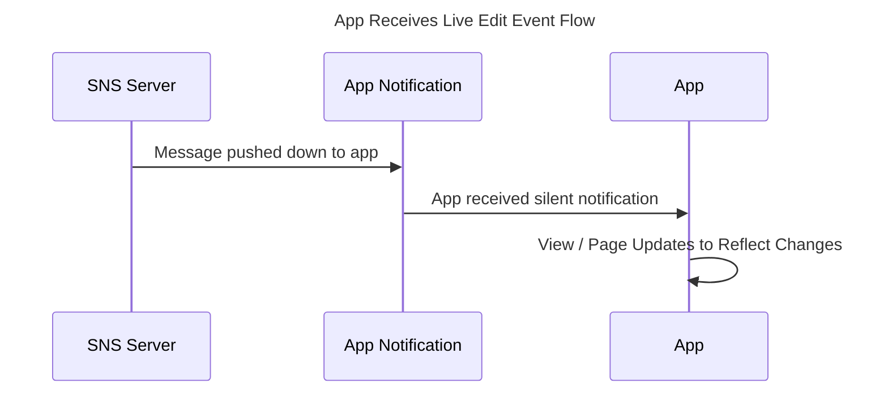
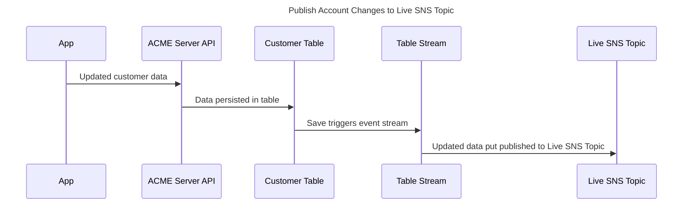

# Live Edit Architecture

The scenario involves a user utilizing an app to view their customer account data. It is essential that any updates made to the customer account through other apps are promptly reflected to the user while they are accessing their data.

## ACME

In our illustrative scenario, let's consider ACME, a company that serves customers who make purchases of widgets.

## Customer Account

A customer account consists of the following information, represented in JSON format:

```json
{
  "id": "46E216CA-9413-4E7E-B5C7-DFAA5AEADF9E",    // UUID generated id
  "name": "John Smith",
  "address": {
    "street1": "101 Main Street",
    "street2": null,
    "city": "Washington DC",
    "state": "DC",
    "zip": "20001"
}
```

## Proposed Design

In order to establish efficient communication, we will adopt the publish/subscribe (pub/sub) pattern, which allows us to promptly inform the user about any modifications made to their account data.

Our design will be hosted on AWS, leveraging its robust infrastructure.

### Participants / Components

* **Customer App** - ACME has developed an app that empowers customers to effortlessly access and manage their account data, enabling them to view and update it with ease.
* **Representive App** - ACME help desk representatives utilize the Representative App to efficiently modify customer data on behalf of the users whenever they contact the company via phone or chat.
* **ACME Server** - An AWS-hosted system that leverages the power of Cognito and Simple Notification Service (SNS) products to enhance its functionality and deliver efficient services.
* **Live SNS Topic** - An AWS SNS topic to streamline communication and facilitate seamless interaction whenever changes take place.
* **Customer Table** - An AWS Dynamo DB table that stores the the Customer Account data mentioned above.

## App Flows

We have the flexibility to utilize different app platforms such as iOS, Android, and web-based applications for our examples. AWS provides extensive SDKs that cover a wide range of platforms, including iOS, Android, web, and more.

* [AWS SDK for iOS](https://github.com/aws-amplify/aws-sdk-ios)
* [AWS SDK for Android](https://github.com/aws-amplify/aws-sdk-android)
* [AWS SDK for JavaScript](https://aws.amazon.com/sdk-for-javascript/) 

 We will assume that ACME utilizes AWS Cognito as its identity provider. Customers are registered and their identity records are securely stored, with a cross-reference to the customer account ID data mentioned earlier, ensuring seamless integration and data consistency.

### Subscribing to Updates

To start receiving messages, it is essential to [create](https://docs.aws.amazon.com/sns/latest/dg/sns-create-subscribe-endpoint-to-topic.html) an endpoint to the desired topic. In our implementation, we employ the AWS SDK to create a subscription endpoint that is associated with the customer ID, guaranteeing unique identification for each user. 

For iOS applications, AWS SNS utilizes the Apple Push Notification Service (APNS) to deliver messages, while for Android applications, Firebase Cloud Messaging (FCM) is used. Please note that AWS SNS push for web clients is not currently supported by AWS SNS.

It is important to highlight that the flow for both the representative app and the customer app is identical. In the sequence diagrams presented below, the term "App" encompasses both the representative and customer applications.





### Published Live Edit Events

To publish event data on the Live topic, we'll utilize [Dynanmo DB streams](https://docs.aws.amazon.com/amazondynamodb/latest/developerguide/streamsmain.html). This feature operates akin to data triggers. By configuring the stream, we can publish changes to account data based on the customer ID key.



## Thoughts and Comments

The architecture presented above offers a method for real-time data editing. We encourage the submission of any additional ideas on this topic.
